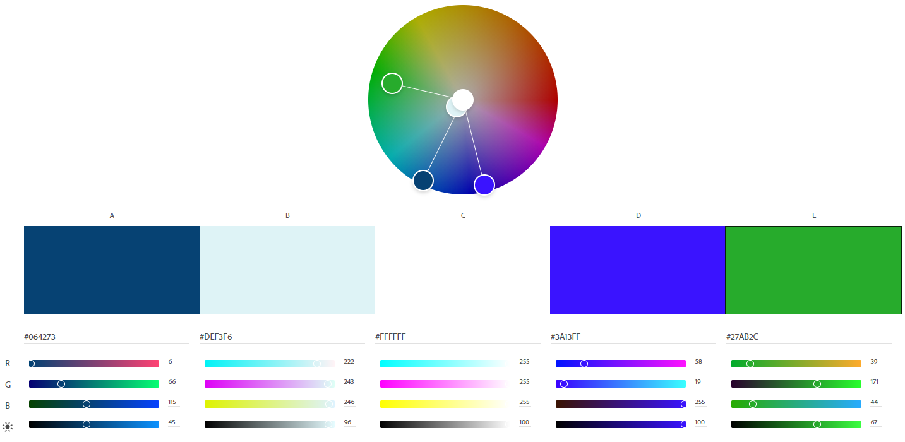
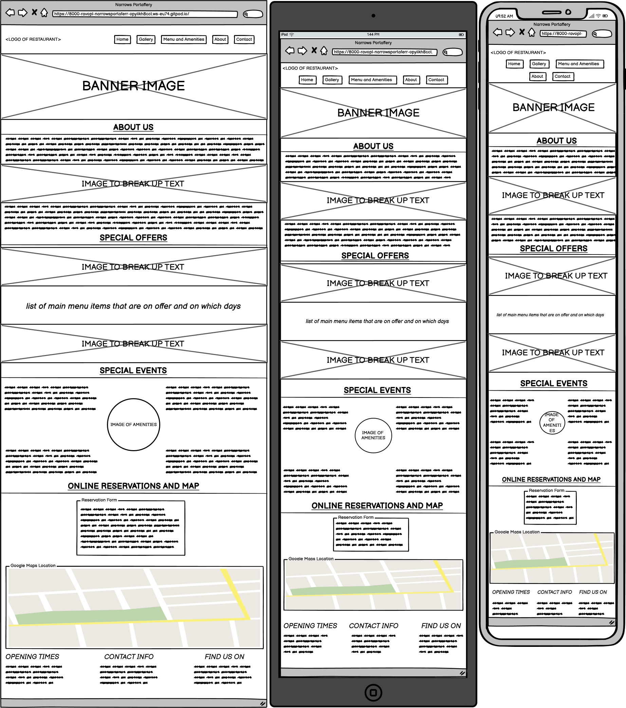
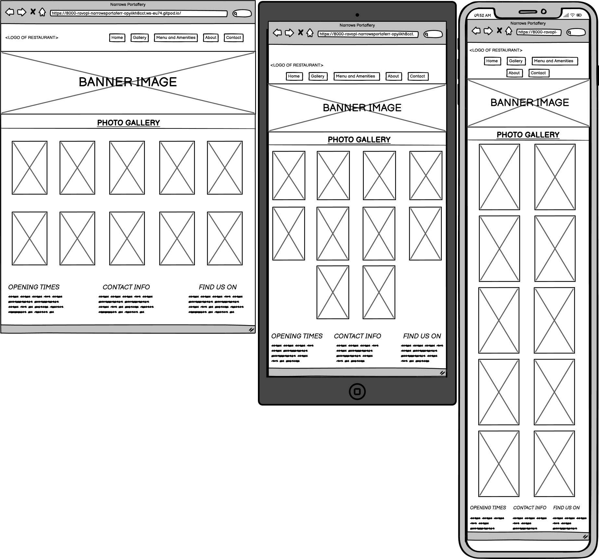
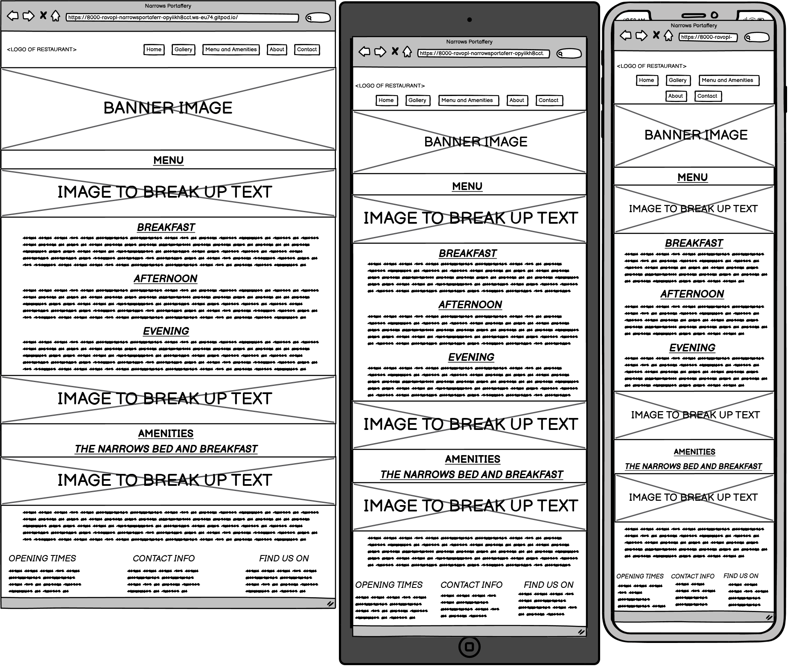

# Narrows Portaferry
Developed by Dorian Wolarz, Code Institute Student

'Placeholder Area for Main Image'

* THINGS TO FIX: Screen size adjustments for the image in Special Events section and for the form
in Online Reservations (right now they're not shrinking properly)

## Contents

'Placeholder Section for Contents List'

## Project Goals

### User Goals

* Find a traditional sea-side restaurant with a well structured, user-friendly webpage.
* Easily find the needed contact information.
* Find the location of the restaurant in Portaferry and its surrounding areas.
* Be able to see a full menu with clear pricing and appealing photos.

### Site Owner Goals

* Promote the business and facilitate its growth.
* Provide a way for customers to contact the business and make orders.
* Provide essential information in regards to opening hours, store location, etc.
* Ensure that customers are aware of special offers and events.

## User Experience

### Target Audience

* New potential customers looking for a nice seaside restaurant.
* Familiar customers looking to order food for delivery.
* Customers looking for catering for small, medium or large parties and special events.

### Customer Requirements and Expectations

* A well structured, user-friendly and efficient webpage.
* Simple and intuitive navigation system.
* A glitchless experience with functions that work properly.
* Excellent webpage design with an appealing, industry standard aesthetic, that seamlessly fits to any screen size.
* A level of accessibility for customers with disabilities.
* Good presentation practices with suitable font types, font sizes and colours of backgrounds.

### Customer Stories and Demands

#### First-time Customer

1. As a new user I want to know where exactly the restaurant is located.
2. I want to know the price range so I can compare it with other restaurants in the area.
3. I'd like to know more about the hours of opening, the special offers and the catering for special events.
4. I'd want to be able to make orders from the webpage without having to make a separate account.
5. I want to know more about the restaurant and the people that work there.
6. I'd love to know about any points of interest close to the restaurant's accommodation.

#### Returning Customer

7. As a returning customer, I'd like to see an expanded list of special offers.
8. As a returning customer I want to know the changed opening hours.
9. As a returning customer I'd like to find the phone number to make reservations.
10. I'd like to see the menu, with a clear pricing list and names of dishes.
11. I want to make orders without having to make a separate account just for this purpose.
12. I would want to find clickable icons to access social media.
13. I'd like to see the directions

#### Webpage Owner

14. As the owner of the website, I want the customers to have an easy way to contact us.
15. I want the customers to have an easy access to on-webpage ordering, so that orders can be forwarded to us without any issues and without the need to make personal accounts to be held in our database.
16. I'd like the users to have a good experience viewing the webpage and getting to know our menu, special offers, special events and a little bit about us as a company and brand.

### Design of the Website

#### Design Choices

The webpage was designed with the idea of a seaside marina restaurant in mind. The general aesthetic of the website is meant to be clean, organized and easily navigatable. The content of the webpage is neatly divided among sections and sub-sections to make the experience easy on the customer.

#### Colour and Fonts

Colour tones associated with the sea were chosen as basis for the colour palette of the webpage as the website is meant to emulate the vibe of a seaside marina. As such, the main colour is turquoise and the font colour is navy, which works well with the restaurant logo as well. For the fonts I chose Open Sans and Source Sans Pro from Google Fonts because they compliment one another very effectively. Arial was chosen as the backup font in case the previous two refuse to load because it's a neat, basic font that will display without any issues on all devices and software.

#### Structure

The website is structured in a user friendly way that makes navigation of its contents extremely easy and pleasing to the eye. The most vital of information which can be stored on one page (*Home, About and Contact*) is done so through a hyperlink connection and relevant information in the webpage's footer section. Other equally vital information which need its own respective pages are stored in the *Gallery* and *Menu and Amenities* pages. As such, the website consists of three separate pages:
* **The Home Page**, with its About and Contact sections down the bottom of the page which can be accessed with just one click
* **The Gallery Page**, with its responsive gallery to enhance a customer's experience and give a glimpse into the restaurant facilities
* **The Menu and Amenities Page**, which stores both the menu and the room rental sections

#### Wireframes

  
Home, About and Contact

  

  
Gallery

  

  
Menu and Amenities

  

### Technologies Used

#### Languages

* HTML
* CSS

#### Tools and Websites

* Git
* GitHub
* GitPod
* Google Fonts
* Adobe Color
* Adobe Photoshop
* Balsamiq

### Features

The website consists of X pages and Y features

#### Logo and Navigation Bar
* Featured on all three separate pages of the website
* Fully responsive, changes size according to the dimensions of the display on a particular device
* The page the user is currently on is highlighted with an underscore styling
* Allows customer for quick and easy navigation of all three separate pages on the website as well as specific sections of the Home page

### Testing of the Webpage

'Placeholder for the Long Testing Section'

### Encountered Bugs

'Placeholder for the Bugs Section'

### Deployment

'Placeholder for the Deployment Section'

### Credits

#### Media

* [Wedding Table Photo](https://www.trulyengaging.com/wp-content/uploads/2011/09/black-headtable.jpg)
* [Restaurant Table Photo One](https://tablefoodanddrink.com/assets/images/slider/_970x450_crop_center-center_75_none/88.jpg)
* [Restaurant Table Photo Two](https://burst.shopifycdn.com/photos/flatlay-iron-skillet-with-meat-and-other-food.jpg?width=1200&format=pjpg&exif=1&iptc=1)
* [Narrows Portaferry Logo (originally made by me)](https://images.squarespace-cdn.com/content/v1/5feb2f1ea55e935ca8ec25d7/1612287749630-9V8B19RDPHRQJL9MCBCZ/NarrowsPortaferry_PNG.png)
* [Narrows Portaferry Front Photo](https://www.facebook.com/narrowsguesthouse/)
* [Portaferry View Photo](https://celticcanada.com/wp-content/uploads/2018/08/charming-villages-ni-portaferry.jpg)
* [Photos for the Responsive Gallery](https://www.facebook.com/narrowsguesthouse/)
* [Menu Banner Photo One](https://www.jetsetter.com//uploads/sites/7/2018/04/t_Px07Lv-1380x690.jpeg)
* [Menu Banner Photo Two](https://cdn-ds.com/blogs-media/sites/223/2020/11/12184137/LXT-top-1112_b.jpg)
* [Amenities Banner Photo One](https://hips.hearstapps.com/clv.h-cdn.co/assets/17/29/1500477714-bed-and-breakfast-index.jpg)
* [Amenities Banner Photo Two](https://www.mercersburginn.com/wp-content/uploads/2015/11/MarieClaire-slide.jpg)
* [Amenities Banner Photo Three](https://ssl.latcdn.com/img/ye3GO0n3z-georgia.jpg)

#### Code and Assets
* [Font Awesome 5 Icons](https://www.w3schools.com/icons/fontawesome5_intro.asp)
* [Footer Code](https://www.youtube.com/watch?v=f4J3uaNNYTE)
* [Responsive Gallery Code](https://timnwells.medium.com/create-a-simple-responsive-image-gallery-with-html-and-css-fcb973f595ea)